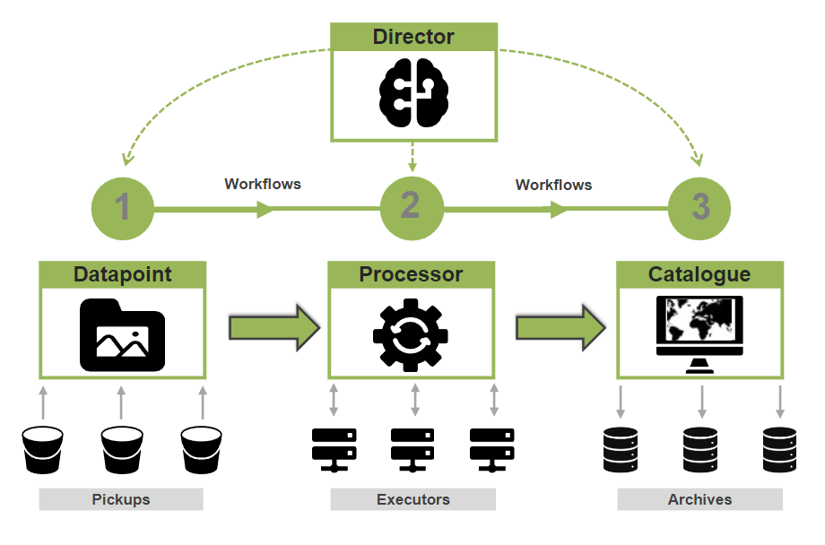

# [Administrator documentation](README.md)

Welcome to the *FarEarth for SmallSats* administrator documentation. This documentation contains all the information to help you deploy and configure your instance of *FarEarth*.

## System overview

The diagram below shows a high-level overview of the *FarEarth* components covered by this documentation.

### Release notes
The release notes are available [here](releaseNotes/releaseNotesSummary.md).

### Datapoint

The [Datapoint](datapoint/datapoint.md) is *FarEarth*'s data management component. The [Pickup](datapoint/pickup/pickups.md) is a type of Datapoint, responsible for detecting any new data to be processed.

We support a number of protocols and cloud storage providers, including Amazon's S3 buckets and Microsoft's Azure Blob stores. Individual storage locations are called "Pickups".s

See also [Pickup configuration](datapoint/pickup/pickups.md).

### Processing

The [Processing](processing/processing.md) component manages all processing nodes within *FarEarth*. Data that is shared between processing nodes are controlled by the **Hosting** subsystem. The **Runtimes** are used to configure the executable nodes.

See also:
* [Hosting configuration](processing/hosting/hosting.md)
* [Runtime configuration](processing/runtimes/runtimes.md)

### Catalogue

The [Catalogue](catalogue/catalogue.md) component includes both the data storage subsystems (the **Archive**) as well as the searchable web front-end. *FarEarth* expands the STAC collections concept to allow for dynamic **Collections** without updating the individual products.

For more information, read our Archive blog: [FarEarth has secure data storage!](https://pinkmatter.com/2025/05/22/farearth-has-secure-data-storage/)

See also:
* [Archive configuration](catalogue/archives/archives.md)
* [Collections configuration](catalogue/collections/collections.md)

### Developer resources

We built *FarEarth* to integrate into your existing systems, and to allow for custom **Workflows**. Review our [Developer](developer/developer.md) documentation for more information.

Most of the capabilities that *FarEarth* has to offer can be access through our **API**s. This includes the ability to query the Catalogue using OpenAPI with STAC-compatible products.

See also:
* [API documentation](developer/api/api.md)
* [Workflow documentation](developer/workflows/workflows.md)

