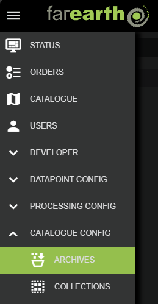
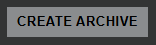

# Archive configuration

##### [Home](../../README.md) > [Catalogue](../catalogue.md) > Archive
---
##### Table of contents
* [Configuration](#configuration)
  + [Create new archive](#create-new-archive)
  + [Edit archive](#edit-archive)
* [Archive details](#archive-details)
  + [Prefix templates](#prefix-templates)
  + [Datastore limits](#datastore-limits)
  + [Rolling archive](#rolling-archive)
  + [Read more](#learn-more)
---

*FarEarth*'s archives manage various datastores, with support for the most popular cloud storage providers. Input data to be processed as well as processed products are all securely stored in one or more archive.

The archive protocols supported by *FarEarth* are:
* [filesystem](archive-filesystem.md): used to integrate local filesystems directly into *FarEarth* (most commonly used in a standalone self-hosted version of *FarEarth*)
* [azure](archive-azure.md): interfaces with Microsoft's Azure blob storage technology
* [amazon-s3](archive-amazon-s3.md): interfaces with Amazon's S3 buckets
* [gdrive](archive-gdrive.md): interfaces with Google Drive cloud storage systems
* [pyxis](archive-pyxis.md): support for *FarEarth*'s own blob storage systems

## Configuration

> **Note**: You require the 'admin' role to be able to create and edit archives in *FarEarth*. The user must have access to the 'Director' resource, or a bundled self-hosted application.

### Create new archive

To create a new archive, or edit an existing archive, follow these steps:

1. Navigate to the ARCHIVES page, under CATALOGUE CONFIG

   

1. Click on the "CREATE ARCHIVE" button on the right

   

1. In the New Archive window, enter the following required fields:

   | Field          | Details     |
   |----------------|-------------|
   | App            | The *FarEarth* application ID where the archive will be created |
   | ID | A unique ID for the archive |
   | Protocol | The protocol that this archive will use (see [protocols](#archive-configuration)) |

1. Click on CREATE

After creating the archive, *FarEarth* will add additional fields automatically to the archive:

| Field | Details |
|-------|---------|
| Enabled | Controls whether the archive is enabled or not |
| File Name | The JSON filename of the archive as stored on disk |
| Shareable | Controls whether the archive may be shared with other subscriptions |
| Exclusive | Limits the archive to be shareable with only one subscription |

The new archive will appear in the list. The archive is pre-populated with a template that requires further editing.

### Edit archive

To edit the archive, click on the 'File Name' in the archive list.

> **Note**: Each archive protocol has unique fields required in the configuration file.

An example of an archive configuration is provided below. For more examples, refer to the protocol-specific documentation (see [protocols](#archive-configuration)).

```json
{
    "id": "farearth.my-archive",
    "protocol": "amazon-s3",
    "displayName": "My Archive",    
    "prefix": "archive/{spacecraft}/{year}/{month}/{day}/{productType}/{productId}/{uuid}",
    "properties": {
        "baseUrl": "https://<region>.amazonaws.com",
        "bucketName": "mybucketname",
        "region": "<insert region>",
        "accessKey": "<insert access key>",
        "secretKey": "<insert secret key>",
        "enableCopyObject": true
    },
    "maxJobs": 5
}
```

## Archive details

The table below lists the various fields in an archive configuration.

| Field | Example Value | Details |
|-------|---------------|-------------|
| `id` | `farearth.azure-archive-101` <br>`farearth.fs-archive-101` | Unique identifier of the archive. The ID starts with the subscription ID (e.g., `farearth`). This ID is used to provide access to the archive for specific users and subscriptions, and to track any activity related to the archive.|
| `protocol` | `azure` `gdrive` `filesystem` <br> `amazon-s3` `pyxis` | The datastore protocol to use. This field determines the required properties.|
| `prefix` | `FarEarth-Testing/{year}/{doy}/{uuid}` | The (virtual) folder structure to use when storing data. Details of the available variables for folder structures below. More information in [Prefix templates](#prefix-templates) |
| `shareable` | `true` `false` | Default: `false` <br> Controls whether the archive may be shared with other subscriptions. Note that setting this to `true` does not yet share the archive. |
| `accessModes` | `PUSH` `PULL` <br>`["PUSH", "PULL"]` | Determines how other *FarEarth* components will get the data from the archive. If set to `PULL`, the component will fetch the data from the archive. It is possible to specify both `PUSH` and `PULL`.|
| `dataStoreLimits` | `capacity`, `warnOnRemaining`, `errorOnRemaining`  | Sets a capacity limit on the archive and controls the behavior of the archive when nearing capacity. More information in [Datastore limits](#datastore-limits) |
| `properties` | | Unique properties required by the specific protocol. For more details, see the protocol specific documentation (links at the [top of this document](#archive-configuration)) |

### Prefix templates

The `prefix` field creates a folder structure using the properties from the products. Not all protocols support folder creation, in which case the same prefix will be used to prefix the file IDs for a virtual folder implementation. The structure is hidden from the *FarEarth* user and is only important if you were to inspect the files directly on the datastore.

The following fields can be used in the `prefix`:

| Field | Example | Details |
|-------|---------|---------|
| `productId` or `id` | `metopa_68198_20191211T015827` | Product ID given by the processors in *FarEarth* |
| `userId` | `test-at-gmail-com` | A modified version of the user ID (email address, e.g., `test@gmail.com`) |
| `storeDataId` | `628` | Unique ID of the product in the current datastore |
| `dataStoreId` | `filesystem-metop-archive` | Name of the current datastore |
| `subscription` | `farearth` | Name of the *FarEarth* subscription of the archive |
| `spacecraft` | `METOP-C` | Name of the spacecraft (source of imagery) |
| `uuid` or `guid` | `f567252a-77b9-11ee-b962-0242ac120002` | Randomly generated unique ID |
| `year` | `2025` | The year taken from `datetime` property of the product |
| `doy` | `01` .. `365` | The day-of-year number taken from `datetime` property of the product |
| `month` | `01` .. `12` | The month number taken from `datetime` property of the product |
| `day` | `01` .. `31` | The day-of-month number taken from `datetime` property of the product |
| `woy` | `01` .. `52` | The weak-of-year number taken from `datetime` property of the product |
| `hours` | `00` .. `23` | The hour-of-day number taken from `datetime` property of the product |
| `minutes` | `00` .. `59` | The minutes-of-hour number taken from `datetime` property of the product |
| `seconds` | `00` .. `59` | The seconds-of-minute number taken from `datetime` property of the product |

### Datastore limits

The options for the `dataStoreLimits` are:

| Datastore limit mode | Details |
|----------------------|---------|
| `capacity` | Sets the  maximum available storage for the datastore (see [Rolling archive](#rolling-archive) for more details). |
| `warnOnRemaining` | Enables a warning for when the archive has reached the the limit specified by this setting. |
| `errorOnRemaining` | Enables an error for when the archive has reached the limit specified by this setting, preventing any further data writing to the datastore. |

An example `dataStoreLimits` configuration is given below. Note that in this example, the capacity is configured to 64GB. When 4GB or less remains, any further writing to the archive will trigger a warning. When 2GB or less remains, the warning is replaced by an error message prompting user action.

```json
    ...
    "dataStoreLimits": {
        "capacity": "64GB",
        "warnOnRemaining": "4GB",
        "errorOnRemaining": "2GB"
    }
    ...
```

### Rolling archive

When a capacity limit is configured in the `dataStoreLimits` field of the archive configuration, *FarEarth* will implement a rolling archive once capacity is reached. In this mode, the oldest product by processed data will be deleted first to free space on the archive.

The capacity limit can be specified using MB, GB or TB. For example: `1000GB` (or `1TB`).

> **Note**: Only data in the Catalogue contribute to the storage limit of the archive. Any data on the datastore that is not part of the Catalogue will not count towards the limit, which may cause the archive to take up more space than what is allocated by *FarEarth*.

## Learn more

To learn more about our secure data storage, read ou blog: [FarEarth has secure data storage!](https://pinkmatter.com/2025/05/22/farearth-has-secure-data-storage/)
