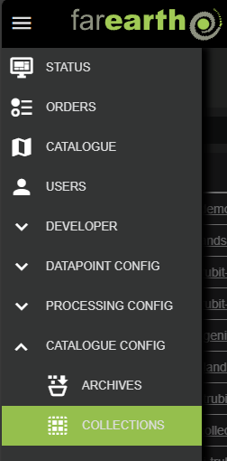
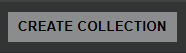

# Collection configuration

##### [Home](../../README.md) > [Catalogue](../catalogue.md) > Collections
---
##### Table of contents
* [Configuration](#configuration)
  + [Create new collection](#create-new-collection)
  + [Edit collection](#edit-collection)
* [Collection details](#collection-details)
---

The *FarEarth* Catalogue extends the STAC collections concept to enable searching for any data in a datastore. It is also possible to search for external STAC compliant catalogues in this way. 

Collections are also the primary method of granting another subscription access files within your archive. This is achieved by sharing the collection resource with another subscription, allowing you to control exactly what kind of products other users should have access to without setting up a dedicated archive.

## Configuration

> **Note**: You require the 'admin' role to be able to create and edit collections in *FarEarth*. The user must have access to the 'Catalogue' resource, or a bundled self-hosted application.

### Create new collection

To create a new collection, or edit an existing collection, follow these steps:

1. Navigate to the COLLECTIONS page, under CATALOGUE CONFIG

   

1. Click on the "CREATE COLLECTION" button on the right

   

1. In the New Collection window, enter the following required fields:

   | Field          | Details     |
   |----------------|-------------|
   | App            | The *FarEarth* application ID where the collection will be created |
   | ID | A unique ID for the collection |
   | Title | A name for the collection |
   | Description | A short description of the collection |

1. Click on CREATE

After creating the collection, *FarEarth* will add additional fields automatically to the collection:

| Field | Details |
|-------|---------|
| Enabled | Controls whether the collection is enabled or not |
| File Name | The JSON filename of the collection as stored on disk |
| Shareable | Controls whether the collection may be shared with other subscriptions |
| Exclusive | Limits the collection to be shareable with only one subscription |

The new collection will appear in the list. The collection is pre-populated with a template that requires further editing.

### Edit collection

To edit the collection, click on the 'File Name' in the collection list.

Below are a few example collection configurations.

**Filter on dataset**

In this example, the collection includes all data with a `dataset` field equal to `qa-data`.


```json
{
    "details": {
        "id": "my.collection",
        "title": "My collection",
        "description": "Short description of my collection"
    },
    "filter": {
        "query": {
            "dataset": {
                "eq": "qa-data"
            }
        }
    }
}
```

**Filter on spacecraft and product type**

This example shows a collection with a compound filter. All conditions of the query must match (AND query). Only `L1A` products, from the `TRUBIT-1` spacecraft, which are stored within the `trueorbit` subscription will be provided.

```json
{
    "details": {
        "id": "farearth.trubit-1-l1a",
        "title": "TRUBIT-1-l1a",
        "description": "",
        "shareable": true        
    },
    "filter": {
        "query": {
            "productType": {
                "eq": "L1A"
            },
            "spacecraft": {
                "eq": "TRUBIT-1"
            },
            "subscriptionId": {
                "eq": "trueorbit"
            }
        }
    }
}
```

**External STAC collection**

Thi is an example of proxying data from an external STAC catalog. The proxy is configured to expose the Element84 Copernicus DEM GLO-30 data, using the AWS Earth Search API.

```json
{
    "details": {
        "id": "farearth.cop-dem-glo-30",
        "title": "Copernicus DEM GLO-30",
        "description": "The Copernicus DEM is a Digital Surface Model (DSM) which represents the surface of the Earth including buildings, infrastructure and vegetation"
    },
    "proxy": {
        "sourceId": "e84-aws-v1",
        "sourceTitle": "AWS Earth Search API (v1)",
        "baseUrl": "https://earth-search.aws.element84.com/v1"
    }
}
```

Below is another example proxying the USGS STAC Server for the Landsat Collection 2 Level 1 products.

```json
{
    "details": {
        "id": "farearth.landsat-c2l1",
        "title": "Landsat Collection 2 L1 products",
        "description": "Landsat Collection 2 L1 products"
    },
    "proxy": {
        "sourceId": "usgs.landsat-c2l1",
        "sourceTitle": "USGS STAC Server",
        "baseUrl": "https://landsatlook.usgs.gov/stac-server"
    }
}
```

## Collection details

The table below lists the various fields in a collection configuration.


> Collection json file contents with definitions:

| Field | Example Value | Details |
|-------|---------------|---------|
| `filter` | `query` | There are multiple available query parameters, that a creator can also link together to create more in depth limited scope searches with. Examples of such query parameters are: |
| `proxy` | `sourceId` `sourceTitle` `baseUrl` | Using external data source providers, there are a few required parameters to access their STAC compliant servers namely: |


The `query` field can include a number of parameters:

| Parameter | Example value | Details |
|-----------|---------------|---------|
| `productType` | `RAW` `L0` `L1A` `L1C` | Search for a specific product type |
| `spacecraft` | `TRUEBIT-1` | Search for a specific spacecraft |
| `subscriptionId` | `farearth` `trueorbit` | Search within a specific subscription |

The `proxy` field must include the following fields:
| Parameter | Details |
|-----------|---------|
| `sourceId` | Unique ID of the data source within a STAC catalog |
| `sourceTitle` | Name associated with the data source |
| `baseUrl` | STAC API endpoint of the source |
