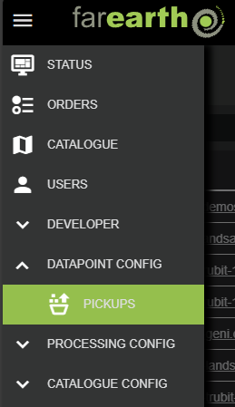

# Pickup configuration

##### [Home](../../README.md) > [Datapoint](../datapoint.md) > Pickup
---
##### Table of contents
* [Configuration](#configuration)
  + [Create new pickup](#create-new-pickup)
  + [Edit pickup](#edit-pickup)
* [Pickup details](#pickup-details)
  + [Additional parameters](#additional-parameters)
  + [Datastore limits](#datastore-limits)
  + [Triggers](#triggers)
* [Trigger file examples](#trigger-file-examples)
  + [Manifest files](#manifest-files)
  + [READY files](#ready-files)
  + [Product files](#product-files)
  + [MD5 files](#md5-files)
---

*FarEarths*'s datapoints manage various data sources, with support for the most popular cloud storage providers. Data that is ingested is typically processed with *FarEarth* or stored directly in the [Archive](../../catalogue/archives/archives.md).

The pickup protocols supported by *FarEarth* are:
* [filesystem](pickup-filesystem.md): used to integrate local filesystems directly into *FarEarth* (most commonly used in a standalone self-hosted version of *FarEarth*)
* [azure](pickup-azure.md): interfaces with Microsoft's Azure blob storage technology
* [amazon-s3](pickup-amazon-s3.md): interfaces with Amazon's S3 buckets
* [gdrive](pickup-gdrive.md): interfaces with Google Drive cloud storage systems
* [pyxis](pickup-pyxis.md): support for *FarEarth*'s own blob storage systems

## Configuration

> **Note**: You require the 'admin' role to be able to create and edit archives in *FarEarth*. The user must have access to the 'Director' resource, or a bundled self-hosted application.

### Create new pickup

To create a new pickup, or edit an existing pickup, follow these steps:

1. Navigate to the PICKUPS page, under DATAPOINT CONFIG

   

1. Click on the "CREATE PICKUP" button on the right

   

1. In the New Pickup window, enter the following required fields:

   | Field          | Details     |
   |----------------|-------------|
   | App            | The *FarEarth* application ID where the pickup will be created |
   | ID | A unique ID for the pickup |
   | Protocol | The protocol that this pickup will use (see [protocols](#pickup-configuration)) |

1. Click on CREATE

After creating the pickup, *FarEarth* will add additional fields automatically to the pickup:

| Field | Details |
|-------|---------|
| Enabled | Controls whether the pickup is enabled or not |
| File Name | The JSON filename of the pickup as stored on disk |
| Shareable | Controls whether the pickup may be shared with other subscriptions |
| Exclusive | Limits the pickup to be shareable with only one subscription |

The new pickup will appear in the list. The pickup is pre-populated with a template that requires further editing.

### Edit pickup

To edit the pickup, click on the 'File Name' in the pickup list.

> **Note**: Each pickup protocol has unique fields required in the configurations file.

An example of a pickup configuration is provided below. For more examples, refer to the protocol-specific documentation (see [protocols](#pickup-configuration)).

```json
{
    "id": "farearth.local-s3-pickup-101",
    "protocol": "amazon-s3",
    "dataRetentionWindow": "12 hours",
    "shareable": true,    
    "properties": {
        "baseUrl": "...",
        "bucketName": "pickup",
        "sqsQueueUrl": "...",
        "region": "us-east-1",
        "accessKey": "...",
        "secretKey": "..."        
    }
}
```

## Pickup details

The table below lists the various fields in an pickup configuration.

| Field | Example Value | Details |
|-------|---------------|-------------|
| `id` | `farearth.azure-pickup-101` <br>`farearth.fs-pickup-101` | Unique identifier of the pickup. The ID starts with the subscription ID (e.g., `farearth`). This ID is used to provide access to the pickup for specific users and subscriptions, and to track any activity related to the pickup.|
| `protocol` | `azure` `gdrive` `filesystem` <br> `amazon-s3` `pyxis` | The data source protocol to use. This field determines the required properties.|
| `dataRetentionWindow` | `12 hours` | Defines how long data is retained in the pickup before automatically being removed |
| `shareable` | `true` `false` | Default: `false` <br> Controls whether the pickup may be shared with other subscriptions. Note that setting this to `true` does not yet share the pickup. |
| `attachParameters` | `workflowId` `sendNotification` | Add optional additional parameters to control the automated pickup. More information in [Additional parameters](#additional-parameters). |
| `dataStoreLimits` | `capacity`, `warnOnRemaining`, `errorOnRemaining`  | Sets a capacity limit on the pickup and controls the behavior of the pickup when nearing capacity. More information in [Datastore limits](#datastore-limits). |
| `properties` | | Unique properties required by the specific protocol. For more details, see the protocol specific documentation (links at the [top of this document](#pickup-configuration)) |
| `triggers` | `READY_FILE` `NO_CHANGE` `FILE_MANIFEST` `MD5_FILE` etc. | Controls the trigger mechanism used by this pickup to accept the input data. More information in [Triggers](#triggers)|

### Additional parameters

These additional parameters can be added to a pickup configuration:

| Parameter | Details |
|-----------|---------|
| `workflowId` | Specifies a specific workflow to run on data ingestion |
| `sendNotifications` | Sends a notification once the data in this pickup completes processing |

### Datastore limits

The options for the `dataStoreLimits` are:

| Datastore limit mode | Details |
|----------------------|---------|
| `capacity` | Sets the  maximum available storage for the pickup. |
| `warnOnRemaining` | Enables a warning for when the datastore has reached the the limit specified by this setting. |
| `errorOnRemaining` | Enables an error for when the datastore has reached the limit specified by this setting. |

### Triggers

Triggers are *FarEarth*'s of identifying suitable data for the specific pickup. It determines how *FarEarth* knows which file belong to a specific product, and when all of the data for that products has finished being loaded into the pickup location.

> **Note**: Input data ingested via a web browser interface, such as Google Drive, should be placed inside a folder.

Each trigger method has additional parameters to set. The supported triggers and their parameters are:

| Trigger | Additional parameters | Details |
|---------|-----------------------|---------|
| `ACCEPT_ALL` | `"delay": "5m"` | All files after a specified delay (5 minutes in the example) |
| `NO_CHANGE` | `"delay": "60s", "minimumFileCount": 3` | All files after a specified delay (60 seconds in the example) if the minimum number of files are reached (3 in the example) |
| `FOLDER_SUFFIX` | `"busySuffix": "_busy", "doneSuffix": "_completed"` | A folder with a specific "done" suffix (`_completed` in the example). This is useful for cases where folder renames are atomic; data is copied to a folder (with a `_busy` suffix), and once completed is renamed instantly with the correct "done" suffix. |
| `FILE_MANIFEST` | `"suffix": "_manifest.txt"` | Triggers once a manifest file, with the specified suffix, containing a list of files, is present. The manifest file should be the last one to be created to ensure that all files have finished copying into the pickup location. More information in [Manifest files](#manifest-files). |
| `READY_FILE` | | Triggers once a sidecar file, with a `*.READY` extension is detected. The sidecar file must have the same name, excluding the ready-extension, as the file to be ingested by the pickup. More information in [READY files](#ready-files). |
| `PRODUCT_FILE` | `"suffix: "_product.json"` | Triggers when a STAC product file, with the specified suffix, is detected. The product file must reside within the folder of the product to be ingested by the pickup. More information in [Product files](#product-files). |
| `MD5_FILE` | `"suffix": ".MD5"` | Triggers when a file containing the MD5 checksums of a list of files is detected. The MD5 file should be within the folder of the product to be ingested by the pickup. More information in [MD5 files](#md5-files) |

> **Note**: The suffixes provided in the table above are the default suffixes for each trigger. They can be omitted from the configuration if the defaults will suffice.

Below is an example of the triggers in JSON:

```json
    "triggers": [
        {
            "id": "ACCEPT_ALL",
            "delay": "5m"
        },
        {
            "id": "NO_CHANGE",
            "delay": "60s",
            "minimumFileCount": 3
        },
        {
            "id": "FOLDER_SUFFIX",
            "busySuffix": "_busy",
            "doneSuffix": "_completed"
        },
        {
            "id": "FILE_MANIFEST",
            "suffix": "_manifest.txt"
        },
        {
            "id": "READY_FILE"
        },
        {
            "id": "PRODUCT_FILE",
            "suffix": "_product.json"
        },
        {
            "id": "MD5_FILE",
            "suffix": ".MD5"
        },
    ]
```

## Trigger file examples

### Manifest files

An example of a manifest file is provided below.

```text
5815_5_20231019132435_TRUBIT-1.raw 13779941880
6839_5_20231019124755_TRUBIT-1.raw 15774919584
```

Each line in the text file contains the name of a file that forms part of the product, with the size of the file, in bytes, after the filename.

### READY files

An example of a READY file is provided below. The file extension is by default `*.READY`.

```json
{
  "workflowId" : "farearth.archive",
  "properties" : {
    "id" : "1-TRUBIT-1-20220120-KANSAS-5",
    "gsd" : [ 5.0, -5.0 ],
    "productType" : "imagery",
    "dataset" : "qa-data",
    "datetime" : "2022-01-20T21:15:30Z",
    "spacecraft" : "TRUBIT-1",
    "instruments" : [ "TB-100" ],
    "bbox" : [ ],
    "eoBands" : [ {
      "name" : "B01",
      "commonName" : "Blue",
      "centerWavelengthNanoMeter" : 490.0,
      "fullWidthHalfMaxNanoMeter" : 65.0
    }, {
      "name" : "B02",
      "commonName" : "Green",
      "centerWavelengthNanoMeter" : 560.0,
      "fullWidthHalfMaxNanoMeter" : 35.0
    }, {
      "name" : "B03",
      "commonName" : "Red",
      "centerWavelengthNanoMeter" : 665.0,
      "fullWidthHalfMaxNanoMeter" : 30.0
    }, {
      "name" : "B04",
      "commonName" : "Red-Edge1",
      "centerWavelengthNanoMeter" : 705.0,
      "fullWidthHalfMaxNanoMeter" : 15.0
    }, {
      "name" : "B05",
      "commonName" : "Red-Edge2",
      "centerWavelengthNanoMeter" : 740.0,
      "fullWidthHalfMaxNanoMeter" : 15.0
    }, {
      "name" : "B06",
      "commonName" : "Red-Edge3",
      "centerWavelengthNanoMeter" : 783.0,
      "fullWidthHalfMaxNanoMeter" : 20.0
    }, {
      "name" : "B07",
      "commonName" : "NIR",
      "centerWavelengthNanoMeter" : 842.0,
      "fullWidthHalfMaxNanoMeter" : 115.0
    } ],
    "geometry" : {
      "type" : "Point",
      "coordinates" : [ -101.40862, 39.18863 ]
    }
  },
  "inputFiles" : {
    "1-TRUBIT-1-20220120-KANSAS-5.TIF" : {
      "id" : "IMAGE",
      "title" : "Unprojected image",
      "roles" : [ "data" ],
      "type" : "image/tiff"
    }
  }
}
```

The ready file must contain the parameters provided in the table below. The fields are part of the STAC specification, with additional fields that can control the *FarEarth* processing.

| Key | Details |
|-----|---------|
| `workflowId` | *FarEarth* Workflow ID to process this data |
| `productType` | STAC product type of the input data |
| `datetime` | Date and time of the input data (format: `yyyy-mm-ddThh:mm:ssZ`) |
| `inputFiles` | One or more files to process (see also required fields below) |

The input files must contain:

| Key | Details |
|-----|---------|
| `inputName` | File name on disk |
| `id` | STAC-compliant ID as part of a collection |
| `title` | Descriptive title for the input file |


### Product files

An example of a product file is provided below.

```json
{
  "type" : "Feature",
  "id" : "1694394734_small",
  "assets" : {
    "RAW" : {
      "title" : "RAW ses file",
      "href" : "sample_500MB.raw",
      "size" : 524288000
    }
  },
  "bbox" : null,
  "geometry" : null,
  "properties" : {
    "spacecraft" : "TRUBIT-1",
    "datetime" : "2023-05-18T07:33:56Z",
    "id" : "1694394734_small",
    "productType" : "RAW"
  },
  "links" : [ ],
  "stac_version" : "0.9.0"
}
```

The product file format is that of the STAC specification.

### MD5 files

An example of an MD5 file is provided below.

```text
9B68D20CD048E31017207ED91817DC7C sample_500MB.raw
```

Each line in the text file contains the name of a file that forms part of the product, preceded with the checksum of the file.
