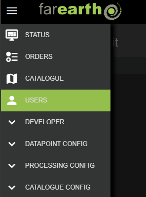
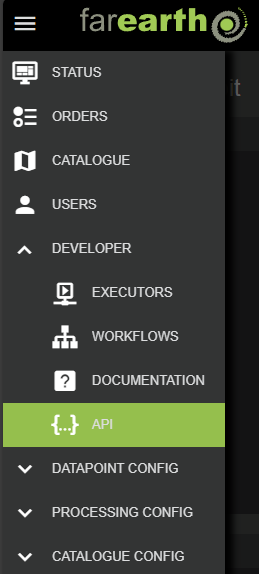

# API configuration and use

##### [Home](../../README.md) > [Developer](../developer.md) > API
---
##### Table of contents
* [Obtaining an API key](#obtaining-an-api-key)
* [Testing access](#testing-access)
* [API documentation](#api-documentation)
* [OpenAPI schemas](#openapi-schemas)
* [STAC access](#stac-access)
* [More examples](#more-examples)
---

This document provides an overview of how to get started using *FarEarth for SmallSats*'s APIs. 

## Obtaining an API key

Every user has a unique API key. The API key allows all actions in FarEarth that the user has access to.

> **Note**: only users with 'Admin' privileges can generate API keys. An Admin user can generate API keys for any other user in the Subscription.

Follow these steps to obtain a unique user API key:

1. Log into the *FarEarth* portal using your Admin user credentials
1. Navigate to the USERS menu

   

1. In the list of users, click on the user's email address
1. On the Edit user panel to the right, click the create button

> **Note**: You can remove the API key and all associated permissions by clicking on the remove button to the right of the key.

## Testing access

You can use the following curl example to verify that the API key works:

```bash
curl -H "Content-Type: application/json" \
  -H "X-API-Key: <insert API key>" \
  -X GET https://gateway.farearth.space/api/ext/v1/test/hello
```

## API documentation

All API interfaces are documented within the *FarEarth* portal. You can use this API page to test the calls themselves.

Follow these steps to navigate to the API documentation within the portal:

1. Log into the *FarEarth* portal using your user credentials
1. Navigate to the API page under the DEVELOPER heading

   

To test the API calls, follow these steps:

1. On the API documentation page in the portal, click the AUTHORIZE button on the right

   

1. Enter the user API key (see steps above on how to obtain)
1. Close the window and navigate to the API call to test
1. Click the "Try it out" button on the right
1. Enter the required parameters
1. Click on "Execute"

The response will show a Curl command equivalent to execute the API query and the valid URL. The response from the server with all headers are also shown.

## OpenAPI schemas

To assist with creating your own API integration, an OpenAPI JSON schema file is available at https://gateway.farearth.space/api/public/api-schema/subscription.

## STAC access

Below is an example using [PySTAC](https://github.com/stac-utils/pystac) to query the *FarEarth* APIs. The example uses an environment variable, namely `FE3_API_KEY` that contains the API key (see details above on how to obtain).

```python
import os
import urllib

FE3_API_URL=R"https://gateway.farearth.space/api/ext/v1/stac/catalogs/farearth.gateway-bundled/farearth.gateway-bundled"

if __name__ == "__main__":

    catalog = Client.open(
        url=FE3_API_URL,
        headers={
            'X-API-Key': os.environ['FE3_API_KEY']
        }
    )

    # Get all the collections that the API key has access to
    collections = catalog.get_collections()

    for collection in collections:
        print(collection)
        # Use the last specified collection
        specific_collection_name = collection.id

    # Get an object representing a specific collection
    specific_collection = catalog.get_collection(specific_collection_name)

    search = catalog.search(
        max_items=30,
        limit=3,
        collections=[specific_collection],
        bbox=[8.518128, 3.663501, 42.038028, -35.811674],
    )

    print(f"{search.matched()} items found")

    for item in search.items():

        # Download thumbnails (previews) if they are available
        if 'THUMB_RGB' in item.assets:
            urllib.request.urlretrieve(item.assets["THUMB_RGB"].href, f"{item.id}_PREVIEW.png")

        # Alternatively, you can download an asset based on its role
        for key, value in item.assets.items():
            if value.roles == 'metadata':
                urllib.request.urlretrieve(item.assets[key].href, f"{item.id}_META.json")
```

## More examples

For more examples of how to interact with teh APIs, visit our GitHub repository at https://github.com/pinkmatter/farearth-api-examples for more examples.
