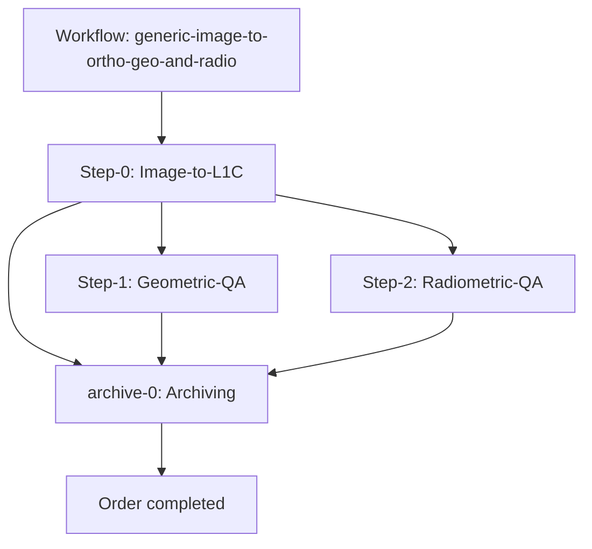
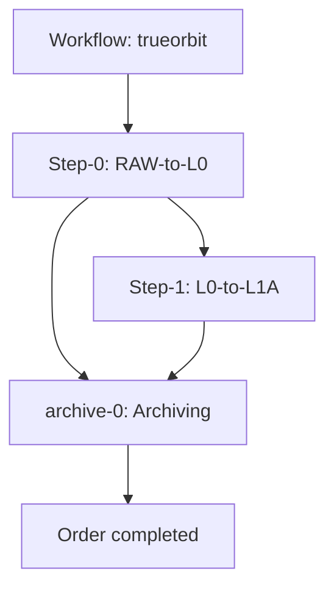

# Workflow configuration

> Back to the [Developer Page](../developer.md)

## Background

**Workflows** are defined as FarEarth's method for managing the multitude of differing processing orders that could potentially run within the FarEarth framework. It is essentially a json blob that specifies all relevant parameters, fields, executors, authorization allowances and steps, that boils down to *jobs* that the system should perform for successful processing of the input data presented by the user/client.

## Configuration

Creating a **Workflow** occurs on the **WORKFLOWS** page under the **DEVELOPER** section of any subscription. 
You do however need to be an **administrator** or **root admin** with a **Director** resource shared to said subscription to have the necessary permissions for creating, editing or deleting a workflow. 

* Take note however that if the workflow is being created under a *bundled* application such as FarEarth's **Gateway-Bundled** or **Director-Bundled**, a *Director* is part of the overall bundled installation, which does not require specific sharing of said resource to the **farearth** subscription.

* To create a new *workflow*, click on the **CREATE WORKFLOW** button, for the **New Workflow** modal to be displayed. Within this modal a few key fields are displayed that should be filled in by the admin user.

> Defining the contents of the modal:

| Field | Description | Details |
|-------|-------------|---------|
| App | Parent Application | The application under which the workflow is being created i.e., *gateway-bundled*, *director-bundled* etc. |
| Display Name | Name of workflow | The actual name of the workflow displayed within the application |
| Description | Workflow description | A description of the search results that would be garnered by running the workflow |
| Subscription | Parent subscription | The subscription under which the workflow is being created such as the *farearth* subscription |
| ID | Workflow ID | The ID value that the admin chooses for the workflow to be created under |
| File Name | JSON file name | The actual file name of the workflow json file generated. This is prepopulated when entering the *ID*, with the *subscription*.*ID*.*workflow*.*json*, however the admin is free to choose what the file name should be, within formatting rules |

* After filling out the form with the workflow details, and clicking the **CREATE** button a new pickup will be generated on the **WORKFLOWS** page, with a default json blob contained within it. This requires further configuration explained below.

> Example of default generated workflow json config:

```json
{
    "id": "farearth.test",
    "displayName": "test",
    "description": "A test workflow",
    "steps": [
        {
            "id": "step-xyz",
            "description": "Step XYZ",
            "executorId": "farearth.xyz",
            "parameters": {
            }
        }
    ]
}
```
* For the above default workflow json blob, there is a plethora of ways to string together steps of a workflow, however there is a simple recipe to follow. Outlined below a few examples of workflows.

> Generic-image-to-ortho-geo-and-radio worklfow example:

```json
{
    "id": "farearth.workflow-generic-image-to-ortho-geo-and-radio",
    "displayName": "SmallSat Workflow",
    "shareable": true,
    "steps": [
        {
            "id": "step-0",
            "displayName": "Image-to-L1C",
            "executorId": "farearth.smallsat-ortho",
            "parameters": {
                "dataHostId": "farearth.azure-host-0",
                "publishDiagnostics": true,             
                "ortho": {
                    "weithingMethod": "DENOMINATOR"
                }                
            }
        },
        {
            "id": "step-1",
            "displayName": "Geometric-QA",
            "executorId": "farearth.qa-geometric",
            "parameters": {
                "publishDiagnostics": true,                
                "dataHostId": "farearth.azure-host-0"                
            }
        },
        {
            "id": "step-2",
            "displayName": "Radiometric-QA",
            "executorId": "farearth.qa-radiometric",
            "parameters": {
                "publishDiagnostics": true,                
                "dataHostId": "farearth.azure-host-0"                
            }
        },
        {
            "id": "archive-0",
            "displayName": "Archiving",
            "executorId": "farearth.azure-archive-0",
            "multi": true
        }
    ],
    "paths": {
        "step-0": ["step-1", "step-2", "archive-0"],
        "step-1": ["archive-0"],
        "step-2": ["archive-0"]
    }
}
```

> Generic-image-to-ortho-geo-only workflow example:

```json
{
    "id": "farearth.workflow-generic-image-to-ortho-geo-only",
    "displayName": "SmallSat Workflow Geo Only",
    "shareable": true,    
    "steps": [
        {
            "id": "step-0",
            "displayName": "Image-to-L1C",
            "executorId": "farearth.smallsat-ortho",
            "parameters": {
                "dataHostId": "farearth.minio-s3-host-0",
                "publishDiagnostics": true,                
                "ortho": {
                    "weithingMethod": "DENOMINATOR"
                }                
            }
        },
        {
            "id": "step-1",
            "displayName": "Geometric-QA",
            "executorId": "farearth.qa-geometric",
            "parameters": {
                "publishDiagnostics": true,                
                "dataHostId": "farearth.minio-s3-host-0"                
            }
        },
        {
            "id": "archive-0",
            "displayName": "Archiving",
            "executorId": "farearth.minio-s3-archive-0",
            "multi": true
        }
	],
    "paths": {
        "step-0": ["step-1", "archive-0"],
        "step-1": ["archive-0"]
    }    
}
```

> Enterprise workflow example:

```json
{
    "id": "farearth.trueorbit",
    "displayName": "Trueorbit Raw-L1A workflow",
    "description": "A Trueorbit Raw-L1A workflow",
    "shareable": true,    
    "steps": [
        {
            "id": "step-0",
            "executorId": "farearth.trubit-1-raw-to-l0",
            "displayName": "RAW-to-L0",            
            "parameters": {
                "publishDiagnostics": false,
                "dataHostId": "farearth.azure-host-0",                
                "subsetting": {
                    "overlap": 256,
                    "rows": 16384
                }
            }
        },
        {
            "id": "step-1",
            "executorId": "farearth.generic-l0-to-l1a",
            "displayName": "L0-to-L1A",            
            "multi": true,
            "parameters": {
                "dataHostId": "farearth.azure-host-0",                
                "radiometrics": {
                    "method": "NONE",
                    "rpfCorrection": "NONE"
                }
            },
            "inputs": {
                "0": [
                    {
                        "productType": "L0"
                    }
                ]
            }            
        },
        {
            "id": "archive-0",
            "executorId": "farearth.azure-archive-0",
            "displayName": "Archiving",            
            "multi": true
        }
    ],
    "paths": {
        "step-0": ["step-1", "archive-0"],
        "step-1": [ "archive-0"]
    }    
}
```
> Simple Archiving workflow example:

```json
{
    "id": "farearth.archive",
    "displayName": "Archive workflow",
    "steps": [
        {
            "id": "archive-0",
            "executorId": "farearth.azure-archive-0"
        }
    ]
}
```

> Benchmarking workflow example:

```json
{
    "id": "farearth.geni-benchmarking",
    "displayName": "Geni-Benchmarking",
    "description": "A Geni-Benchmarking workflow",
    "shareable": true,
    "steps": [
        {
            "id": "step-0",
            "displayName": "Image-to-L1C",
            "executorId": "farearth.smallsat-ortho",
            "parameters": {
                "dataHostId": "farearth.minio-s3-host-0",             
                "ortho": {
                    "weithingMethod": "DENOMINATOR"
                }                
            }
        },
        {
            "id": "step-1",
            "displayName": "Geometric-QA",
            "executorId": "farearth.qa-geometric",
            "parameters": {
                "dataHostId": "farearth.minio-s3-host-0"              
            }
        },
        {
            "id": "step-2",
            "displayName": "Radiometric-QA",
            "executorId": "farearth.qa-radiometric",
            "parameters": {
                "dataHostId": "farearth.minio-s3-host-0"               
            }
        },
        {
            "id": "step-3",
            "displayName": "Geni Report QA",
            "executorId": "farearth.geni-qa-report",
            "parameters": {
                "dataHostId": "farearth.minio-s3-host-0"
            }
        },
        {
            "id": "archive-0",
            "displayName": "Archiving",
            "executorId": "farearth.minio-s3-archive-0",
            "multi": true,
            "parameters": {
                "attachProperties": {
                    "dataset": "Geni-1.1.6-session-1"
                }
            }
        }
    ],
    "paths": {
        "step-0": ["step-1", "step-2", "step-3", "archive-0"],
        "step-1": ["step-3", "archive-0"],
        "step-2": ["step-3", "archive-0"],
        "step-3": ["archive-0"]
    }
}
```

* To explain the content of the worfklow json files in more detail the table below.

> Workflow json file contents with definitions:

| Field | Example Value | Description | Details |
|-------|---------------|-------------|---------|
| id | farearth.workflow-generic-image-to-ortho-geo-and-radio, farearth.trueorbit, farearth.archive etc. | Workflow ID | This field is the workflow's physical ID which includes the subscriptionID under which it has been created. This is used as part of the audit and authorization trail for the workflow itself |
| shareable | true, false | Shareable Resource | Sets the workflow as shareable or not as a resources for other subscriptions than the one it was created on. The flag is set to *false* by default if omitted from the config file |
| steps | step-0, step-1, step-2, etc. | Order steps | The section contains all the relevant sequentially listed jobs (and their respective parameters) required to finish the processing order |
|  |  |  | - executorId: The ID of the physical executor that is responsible for the current step |
|  |  |  | - multi:  This flag indicates if the current step is expecting multiple input files or not. It is by default set to *false*|
|  |  |  | - parameters: This section is very customizable and allows the operator to add unique fields that are supported by the relevant executor. This includes fields that affect radiometrics, ortho generation, specifying which dataHost to use, attaching properties to the actual data etc. |
|  |  |  | - dataHostId: This parameter specifies which dataHost should be used for the particular step, and allows for greater flexibility than just one default hosting |
|  |  |  | - attachProperties: This parameter allows the operator to add properties to the data utilized by the particular step. In the above example it attaches a label to the dataset so that the operator is able to create a collection for it. Enabling the operator to view that specific set in the Catalogue |
| paths | step-0, step-1, step-2 etc. | Step data dependencies | Paths defines effectively which steps rely on data/products created by a previous step for it to continue with the processing order |
|  |  |  | - step-{number}: In the above example *step-0* produces output products that, *step-1*, *step-2*, *step-3*, and *archive-0* rely on. This means that for *step-1* to continue it needs the processed data from *step-0*. Similarly the *archive-0* step needs *step-0*'s data so that it is able to publish the contents into the Archive and subsequent Catalogue for viewing |

* With respect to the above workflows, it's easy to see that workflows can look complicated, but breaking it down to effectively a chain of events that follow one after the other each having their own parameters, it is incredibly easy to use. To illustrate this, the follwing two diagrams simplifying example workflows from above:


------------------------------------------------

------------------------------------------------

* One last note regarding the **"shareable": true,** flag, if this is set to *true* (default it is set to *false*), and the **workflow** has been correctly configured, the newly added workflow will be shareable from the **Subscriptions** page under any of the available *group* and/or *default* subscriptions by a *root admin*, effectively making the workflow a shareable resource.

> Back to the [Developer Page](../developer.md)