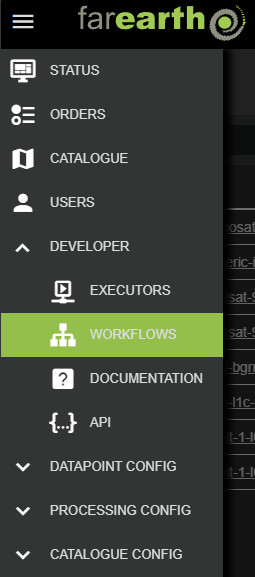
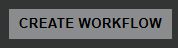
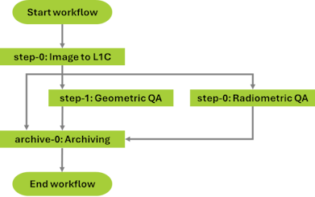
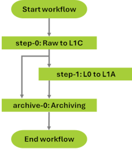

# Workflow configuration

##### [Home](../../README.md) > [Developer](../developer.md) > Workflow
---
##### Table of contents
* [Background](#background)
* [Configuration](#configuration)
  + [Create new workflow](#create-new-workflow)
  + [Edit workflow](#edit-workflow)
  + [Example workflows](#example-workflows)
* [Workflow details](#workflow-details)
---

## Background

*FarEarth* uses the concept of **Workflows** to direct the system on how to process data. It defines the individual processing steps and their parameters. This subsystem also tracks the progress of processing orders and manages the authorization to execute specific tasks.

A Workflow is typically triggered by data arriving at a [Pickup point](../../datapoint/pickup/pickups.md), but there are several other methods of starting a Workflow within *FarEarth*.

> **Note**: You require the 'admin' role to be able to create and edit workflows in *FarEarth*. The user must have access to the 'Director' resource, or a bundled self-hosted application.

## Configuration

### Create new workflow

To create a new workflow, or edit an existing workflow, follow these steps:

1. Navigate to the WORKFLOWS page

   

1. Click on the "CREATE WORKFLOW" button on the right

   

1. Enter the following required fields:

   | Field | Details |
   |-------|---------|
   | App | The *FarEarth* application ID where the workflow will be created |
   | Display Name | The actual name of the workflow displayed within the application |
   | Description | A short description of the workflow |
   | ID | A unique ID for the workflow |

1. Click on the "CREATE" button on the bottom of the window.

After creating the workflow, *FarEarth* will add additional fields automatically to the workflow:

| Field | Details |
|-------|---------|
| Enabled | Controls whether the workflow is enabled or not |
| File Name | The JSON filename of the workflow as stored on disk |
| Shareable | Controls whether the workflow may be shared with other subscriptions |
| Exclusive | Limits the workflow to be shareable with only one subscription |

> **Note**: More details about these fields are provided in the [Workflow details](#workflow-details) section below

The new workflow will appear in the list. The workflow is pre-populated with a template that requires further editing.

### Edit workflow

To edit the workflow, click on the 'File Name' in the workflow list.

The example below shows the workflow template created above.

```json
{
    "id": "farearth.test",
    "displayName": "test",
    "description": "A test workflow",
    "steps": [
        {
            "id": "step-xyz",
            "description": "Step XYZ",
            "executorId": "farearth.xyz",
            "parameters": {
            }
        }
    ]
}
```

### Example workflows

Below are a few workflow examples. More details about the workflow steps are in the next section.

**Example 1: Generic image orthorectification, with radiometric and geometric validation**

This example shows a workflow with a generic Level 1C processor, followed by some QA and archiving steps processed in parallel. The results of the QA steps are then also archived.



This workflow features:
* Three processing steps:
  1. Level 1C processing
  1. Geometric QA
  1. Radiometric QA
* An archiving step
* The `paths` object at the bottom links the steps to each other:
  * After processing the Level 1C in `step-0`, the output is processed in parallel by `step-1` and `step-2`, and archived in `archive-0`
  * The output from `step-1` and `step-2` are also archived separately

```json
{
    "id": "farearth.workflow-generic-image-to-ortho-geo-and-radio",
    "displayName": "SmallSat Workflow",
    "shareable": true,
    "steps": [
        {
            "id": "step-0",
            "displayName": "Image-to-L1C",
            "executorId": "farearth.smallsat-ortho",
            "parameters": {
                "dataHostId": "farearth.azure-host-0",
                "publishDiagnostics": true,             
                "ortho": {
                    "weithingMethod": "DENOMINATOR"
                }                
            }
        },
        {
            "id": "step-1",
            "displayName": "Geometric-QA",
            "executorId": "farearth.qa-geometric",
            "parameters": {
                "publishDiagnostics": true,                
                "dataHostId": "farearth.azure-host-0"                
            }
        },
        {
            "id": "step-2",
            "displayName": "Radiometric-QA",
            "executorId": "farearth.qa-radiometric",
            "parameters": {
                "publishDiagnostics": true,                
                "dataHostId": "farearth.azure-host-0"                
            }
        },
        {
            "id": "archive-0",
            "displayName": "Archiving",
            "executorId": "farearth.azure-archive-0",
            "multi": true
        }
    ],
    "paths": {
        "step-0": ["step-1", "step-2", "archive-0"],
        "step-1": ["archive-0"],
        "step-2": ["archive-0"]
    }
}
```

**Example 2: Generic image orthorectification, with geometric validation only**

This workflow features:
* Two processing steps:
  1. Level 1C processing
  1. Geometric QA
* An archiving step
* The `paths` object at the bottom links the steps to each other:
  * After processing the Level 1C in `step-0`, the output is processed in `step-1` and archived in `archive-0` (in parallel)
  * The output from `step-1` is are also archived separately

```json
{
    "id": "farearth.workflow-generic-image-to-ortho-geo-only",
    "displayName": "SmallSat Workflow Geo Only",
    "shareable": true,    
    "steps": [
        {
            "id": "step-0",
            "displayName": "Image-to-L1C",
            "executorId": "farearth.smallsat-ortho",
            "parameters": {
                "dataHostId": "farearth.local-s3-host-0",
                "publishDiagnostics": true,                
                "ortho": {
                    "weightingMethod": "DENOMINATOR"
                }                
            }
        },
        {
            "id": "step-1",
            "displayName": "Geometric-QA",
            "executorId": "farearth.qa-geometric",
            "parameters": {
                "publishDiagnostics": true,                
                "dataHostId": "farearth.local-s3-host-0"                
            }
        },
        {
            "id": "archive-0",
            "displayName": "Archiving",
            "executorId": "farearth.local-s3-archive-0",
            "multi": true
        }
	],
    "paths": {
        "step-0": ["step-1", "archive-0"],
        "step-1": ["archive-0"]
    }    
}
```

**Example 3: Enterprise processing**

Where the workflows above used generic processing steps, this example requires specific processing components to work. Specifically, the Level 0 processing step takes in raw data and has a specific processing component to prepare it for further processing.



This workflow features:
* Two processing steps:
  1. Level 0 processing (note the unique 'trubit-1' processor)
  1. Level 1A processing
* An archiving step
* The `paths` object at the bottom links the steps to each other:
  * The data is processed in `step-0` and the results processed in `step-1` and archived in `archive-0` (in parallel)
  * The output from `step-1` is archived separately

```json
{
    "id": "farearth.trueorbit",
    "displayName": "Trueorbit Raw-L1A workflow",
    "description": "A Trueorbit Raw-L1A workflow",
    "shareable": true,    
    "steps": [
        {
            "id": "step-0",
            "executorId": "farearth.trubit-1-raw-to-l0",
            "displayName": "RAW-to-L0",            
            "parameters": {
                "publishDiagnostics": false,
                "dataHostId": "farearth.azure-host-0",                
                "subsetting": {
                    "overlap": 256,
                    "rows": 16384
                }
            }
        },
        {
            "id": "step-1",
            "executorId": "farearth.generic-l0-to-l1a",
            "displayName": "L0-to-L1A",            
            "multi": true,
            "parameters": {
                "dataHostId": "farearth.azure-host-0",                
                "radiometrics": {
                    "method": "NONE",
                    "rpfCorrection": "NONE"
                }
            },
            "inputs": {
                "0": [
                    {
                        "productType": "L0"
                    }
                ]
            }            
        },
        {
            "id": "archive-0",
            "executorId": "farearth.azure-archive-0",
            "displayName": "Archiving",            
            "multi": true
        }
    ],
    "paths": {
        "step-0": ["step-1", "archive-0"],
        "step-1": [ "archive-0"]
    }    
}
```

**Example 4: Archive only**

This is a very simple workflow that simply archives the input data without any processing. There is only a single `archive-0` step.

```json
{
    "id": "farearth.archive",
    "displayName": "Archive workflow",
    "steps": [
        {
            "id": "archive-0",
            "executorId": "farearth.azure-archive-0"
        }
    ]
}
```

## Workflow details

The table below lists the various fields in a workflow configuration.

| Field | Examples      | Details |
|-------|---------------|---------|
| `id`    | `farearth.workflow-generic-image-to-ortho-geo-and-radio` <br> `farearth.trueorbit` `farearth.archive` | Unique identifier of the workflow. The ID starts with the subscription ID (e.g., `farearth`). This ID is used to provide access to the workflow for specific users and subscriptions, and to track any activity related to the workflow.
| `shareable` | `true` `false` | Default: `false` <br> Controls whether the workflow may be shared with other subscriptions. Note that setting this to `true` does not yet share the workflow. |
| `steps` | `step-1`, `archive-0` | This section contains the processing steps for the workflow. Each step has more parameters: <br> `executorId`: The ID of the executor that will be used in this processing step <br> `multi`: Indicates whether this step of processing requires multiple inputs before it executes (see note below) <br> `parameters`: Contains the custom parameters specific to this processing step (see the executor documentation for details) <br> `dataHostId`: The unique [Data host](../../processing/hosting/hosting.md) ID where the results of this step will be stored temporarily (must be accessible by subsequent steps) <br> `attachProperties`: Properties to add to the input data for this step |
| `paths` | `"step-0": ["step-1", "archive-0"]`, etc. | The sequence by which the workflow steps are to be execute. <br> The *key* selects the input step, of which the output will be processed in parallel by the steps listed as the *value* of this parameter. For the example on the left, the output of `step-0` will be processed by both `step-1` and the `archive-0` steps. |

> **Note**: A processing step can produce multiple outputs while it is processing. To allow for performance optimisation, the individual output products can be processed by subsequent steps in parallel. If the subsequent step has the `multi` flag set to `true`, it means that it will wait for the previous processing steps to finish before processing anything.

> **Note**: If the `shareable` flag is set to `true`, the workflow can be shared by the 'admin' user from the SUBSCRIPTIONS page.
