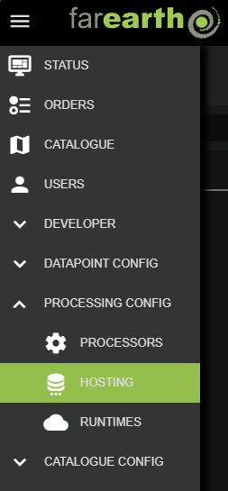
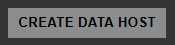

# Hosting configuration

##### [Home](../../README.md) > [Processing](../processing.md) > Hosting
---
##### Table of contents
* [Configuration](#configuration)
  + [Create new host](#create-new-host)
  + [Edit host](#edit-host)
* [Host details](#host-details)
---

*FarEarth* uses the concept of "hosting" to share data between processing nodes (executors). Each executor stores the output from its processing job on a host, to be fetched there by the next processing node.

*FarEarth* supports these hosting protocols:
* [filesystem](hosting-filesystem.md): Local filesystem used by processors running on the same system, typically as part of a bundled single executable environment
* [azure](hosting-azure.md): Protocol leveraging Microsoft Azure's blob storage
* [amazon-s3](hosting-amazon-s3.md): Protocol leveraging Amazon's S3 buckets

## Configuration

> **Note**: You require the 'admin' role to be able to create and edit hosting in *FarEarth*. The user must have access to the 'Director' resource, or a bundled self-hosted application.

### Create new host

1. Navigate to the HOSTING page, under PROCESSING CONFIG

   

1. Click on the "CREATE DATA HOST" button on the right

   

1. In the New Data Host window, enter the following required fields:

   | Field          | Details     |
   |----------------|-------------|
   | App            | The *FarEarth* application ID where the host will be created |
   | Subscription | The subscription that will own the host configuration |
   | ID | A unique ID for the host |
   | Protocol | The protocol that this host will use (see [protocols](#hosting-configuration)) |

1. Click on CREATE

After creating the host, *FarEarth* will add additional fields automatically to the host:

| Field | Details |
|-------|---------|
| Enabled | Controls whether the archive is enabled or not |
| File Name | The JSON filename of the archive as stored on disk |
| Shareable | Controls whether the archive may be shared with other subscriptions |
| Exclusive | Limits the archive to be shareable with only one subscription |

The new host will appear in the list. The host is pre-populated with a template that requires further editing.

### Edit host

To edit the host, click on the 'File Name' in the hosts list.

> **Note**: Each host protocol has unique fields required in the configuration file.

An example of a host configuration is provided below. For more examples, refer to the protocol specific documentation (see [protocols](#hosting-configuration)).

```json
{
    "id": "farearth.aws-s3-host-101",
    "protocol": "amazon-s3",
    "dataRetentionWindow": "12 hours",
    "properties": {
        "baseUrl": "...",
        "bucketName": "hosting",
        "region": "...",
        "accessKey": "...",
        "secretKey": "..."
    }
}
```

## Host details

The table below lists the various fields in a host configuration.

| Field | Example Value | Details |
|-------|---------------|-------------|
| `id` | `farearth.azure-host-101` `farearth.fs-host-101` | Unique identifier of the host. The ID startss with the subscription ID (e.g., `farearth`). This ID is used to provide access to the host for specific users and subscriptions, and to track any activity related to the host. |
| `protocol` | `azure` `gdrive` `filesystem` <br> `amazon-s3` `pyxis` | The hosting protocol to use. This field determines the required properties.|
| `dataRetentionWindow` | `12 hours` | Defines how long data is retained in the host before automatically being removed |
| `shareable` | `true` `false` | Default: `false` <br> Controls whether the host may be shared with other subscriptions. Note that setting this to `true` does not yet share the host. |
| `properties` | | Unique properties required by the specific protocol. For more details, see the protocol specific documentation (links at the [top of this document](#hosting-configuration)) |
