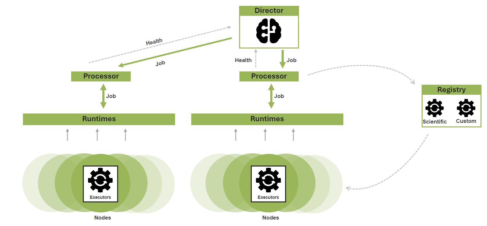

# Processing configuration

##### [Home](../README.md) > Processing
---

*FarEarth* processing jobs are executed by an executor on a node. The context within which it executes are referred to as the runtimes. Runtime configurations are where you tell *FarEarth* how to run an executor.

See also: [Runtimes](runtimes/runtimes.md)

Data is shared between nodes using hosts.

See also: [Hosting](hosting/hosting.md)

